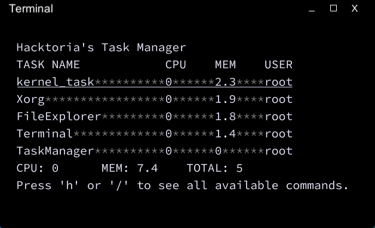

# Task Manager

_Task Management has never been so easy!_

Important note: this is __NOT A REAL PROGRAM__! This has been made, works and will work only in the game called Grey Hack!

## Objectives

Task Manager aims to bring the functionality of Activity Manager(from Microsoft Windows) or Process Monitor(from GNU/Linux) into the Grey Hack

## Features

There are some of the features that Task Manager has:

- Htop mode: Watch for tasks appearance and disappearance in real time
- Guard mode: Terminate any task that appeared just after you launched this mode
- Termination: Terminate selected tasks
- Snapshotting: Create snapshots of selected tasks
- Keyboard controls: One button for one command. No long commands that you need to type in

## Known Bugs

- None so far, so You tell me!

## Installation Guide

Easy way:
- Download __OneFileVersion.src__ and compile it
- Launch compiled binary. Press 'h' to see all available commands

Hard way:
- Download __sh411Lib.src__ and __TaskManager.src__
- Change the _import_code()_ path in __TaskManager.src__ to the path where __sh411Lib.src__ is located
- Compile __ProcessMonitor.src__
- Launch compiled binary. Press 'h' to see all available commands

## License

This software is licensed under GPL v3. See [here](https://github.com/h4cktoria/task-manager/blob/main/LICENSE) for full details

> Task Manager - Control the flow of tasks.
> Copyright (C) 2023  Hacktoria
>
> This program is free software: you can redistribute it and/or modify
> it under the terms of the GNU General Public License as published by
> the Free Software Foundation, either version 3 of the License, or
> (at your option) any later version.
>
> This program is distributed in the hope that it will be useful,
> but WITHOUT ANY WARRANTY; without even the implied warranty of
> MERCHANTABILITY or FITNESS FOR A PARTICULAR PURPOSE.  See the
> GNU General Public License for more details.

## Thanks and Credits

- [Grey Hack](https://store.steampowered.com/app/605230/Grey_Hack/)
- [Joe Strout](https://github.com/JoeStrout) - for creating [MiniScript](https://github.com/JoeStrout/miniscript)
- [Guest](https://mstdn.social/@fmmaks) - for giving me the moto idea
